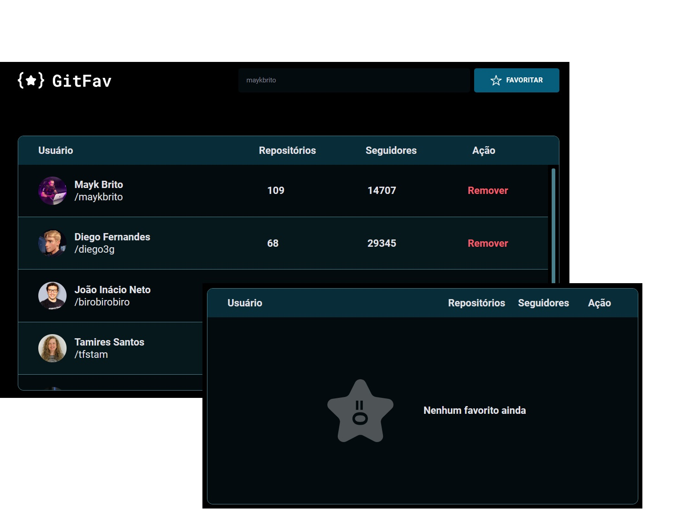

<h1 align="center"> GIT FAVORITE </h1>

O que foi abordado nesse desafio:

- Acessibilidade sr-only (screen read only);
- Criação de HTML com JS;
- Imutabilidade de dados;
- Uso do localStorage do navegador;
- Metodos estáticos e promessas.

  

- [Acesse o projeto finalizado, online](https://desafio-gitfav.vercel.app/)

## 🚀 Tecnologias

Esse projeto foi desenvolvido com as seguintes tecnologias:

- HTML e CSS
- JavaScript
- Git e Github
- Figma
